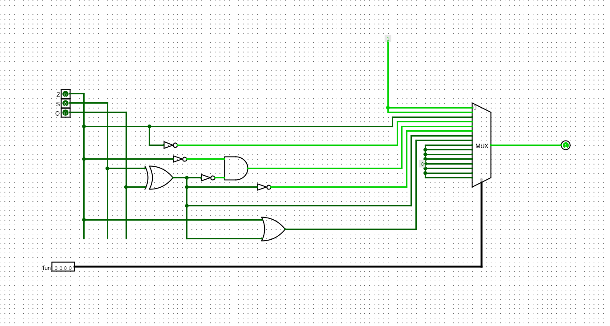
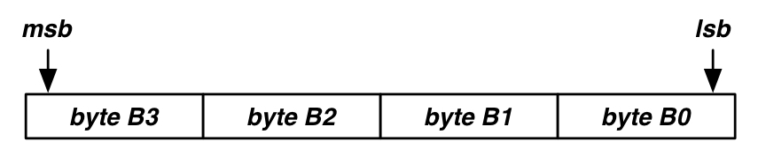
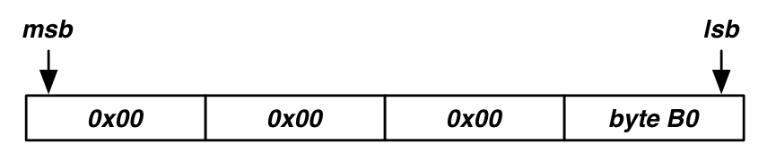
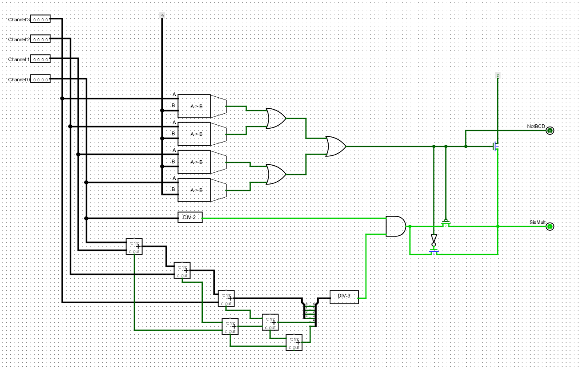

# Dartmouth College

## COSC 051: Computer Architecture

### Homework 4 Report

#### Professor: Sean Smith

#### Student: Amittai Wekesa

##### Problem 1: Condition Checker (15 points)

In your Y86, you will need a combinatorial circuit that decides, based on the condition codes and the 4-bit ifun field, whether the condition codes satisfy the condition specified in the ifun scenario for the cmovXX and  jXX instructions.

Build a combinatorial circuit that calculates this:

cnd.jpg

Remember Fig 4.3 and 3.12 are on our cheatsheet.   The "ifun" code is the least significant nibble in that table---the one that changes per the function.   And recall that in these tables:

"|" means "or"
"&" means "and"
"~" means "not"
"^" means "xor"

###### **Solution 1**



###### **Discussion**

To build the condition-ckecker, I used a multiplexer to pass different variations of the input signals depending on which ifun signal is active. The signals run through several gates before reaching the multiplexer, such that at the time they reach the multiplexer each signal is either on or off for a specific reason. The multiplexer then filters the specific signal that should be checked and passes it through to the output.

\pagebreak

##### Problem 2 (10 points)

Practice problem 4.1 from the textbook (p341).   Assemble this by hand! (Don't use the simulator; don't look at the sample solution in the book.)  Yes, you may use the cheatsheet.

```assembly
.pos 0x00   # Start code at address 0x100
    irmovl $15, %ebx        # Load 15 into %ebx
    rrmovl %ebx, %ecx       # Copy 15 into %ecx
    
loop:                       # loop:
    rmmovl %ecx, -3(%ebx)   #   Save %ecx at address 15-3=12
    addl %ebx, %ecx         # Increment %ecx by 15
    jmp loop                # Goto loop
```

###### **Solution 2**

```text
30f30f000000
2031

0x0008:
    4013fdffffff
    6031
    7008000000
```

\pagebreak

##### Problem 3 (20 points)

Suppose that this (little-endian) 4-byte word lives at address "target":


Write a subroutine that will get the following into register %eax:



(Essentially, fetch just the least significant byte, with the rest zeros!)

(And yes.... this means that the caller will expect this result to have overwritten whatever happened to be in %eax on the way in.)

###### **Solution 3**

```assembly
# Program to read a value from memory into a register.
#
# Author: Amittai Siavava <github: @siavava>
# CS 51 ~ Computer Architecture, Fall '21


.pos 0
Init:
    
    # fetch target value into eax
    irmovl target, %ecx             # move target ADDRESS into %ecx
    mrmovl (%ecx), %eax             # fetch data at ADDRESS in %ecx into %eax
    ret
    
# data stored at target address.
target:
    .byte 0xf
    .byte 0x00
    .byte 0x02
    .byte 0xe
```

\newpage

##### Problem 4 (35 points)

Write an assembler program that does the same thing as Q4 from HW2.

Have memory locations (in data) with the targets "input" and "output"
When the program begins, "input" has the four BCD digits, as four bytes. E.g.

```assembly
    input:    # asking about the decimal number 1234.
      .byte 0x04
      .byte 0x03
      .byte 0x02
      .byte 0x01
```

When the program ends, the 4-byte word at "output" contains
1, if the input (decimal number, represented as BCD) is a multiple of 6.
0, if it is not  
0xE, if there's an error---because the input was not valid BCD.  
You may wish to use Q3 above as a subroutine.   Or perhaps not.

\newpage

###### **Solution 4**

```assembly
# Program to read a value from memory into a register.
#
# Author: Amittai Siavava <github: @siavava>
# CS 51 ~ Computer Architecture, Fall '21


.pos 0
init:    
    irmovl Stack, %esp          # Initialize stack pointer
    irmovl  Stack, %ebp         # Initialize base pointer
    
    # load input into %edi
    irmovl input, %esi          # load input ADDRESS into %esi
    mrmovl (%esi), %edi         # load input VALUE into %edi
    rrmovl %edi, %esi           # copy input VALUE into %esi
    
    
    irmovl 0x04, %ecx           # move 4 into %ecx
    addl %ecx, %esp             # advance stack pointer
    call CheckBCD               # Call checkBCD

    # NOTE: CheckBCD sets flag and exits
    # # if value in %esi is not a valid BCD.
    
    rrmovl %edi, %esi          # copy input VALUE into %esi
    addl %ecx, %esp            # advance stack pointer
    call DIV_TWO               # Call DIV_TWO
    
    # NOTE: DIV2 sets flag and exits
    # # if value in %esi is not divisible by 2.

    rrmovl %edi, %esi           # copy input VALUE into %esi
    addl %ecx, %esp             # advance stack pointer
    call DIV_THREE              # Call DIV_THREE
    
    # NOTE: DIV3 sets flag and exits
    # # if value in %esi is not divisible by 3.

    # set divisible by 6 flag and exit
    irmovl output, %esi         # load output ADDRESS into %esi 
    irmovl 0x01, %edi           # load 1 into %edi
    rmmovl %edi, (%esi)         # store 1 into output ADDRESS
    halt    

CheckBCD:
    # check each digit.
    irmovl 0x0a000000, %eax     # load 10 into %eax, shifted to match digit position
    subl %eax, %esi             # subtract 10 from %esi, at the position
    jge NotBCD                  # if %esi >= 0, jump to NotBCD
    
    
    irmovl 0x00ffffff, %eax     # load all 1s into %eax, shifted to drop unwanted values
    andl %eax, %esi             # AND %esi with %eax, to drop unwanted values
    
    irmovl 0x000a0000, %eax     # load 10 into %eax, shifted to match digit position
    subl %eax, %esi             # subtract 10 from %esi, at the position
    jge NotBCD                  # if %esi >= 0, jump to NotBCD
    
    
    irmovl 0x0000ffff, %eax     # load all 1s into %eax, shifted to drop unwanted values
    andl %eax, %esi             # AND %esi with %eax, to drop unwanted values
    
    irmovl 0x00000a00, %eax     # load 10 into %eax, shifted to match digit position
    subl %eax, %esi             # subtract 10 from %esi, at the position
    jge NotBCD                  # if %esi >= 0, jump to notBCD
    
    
    irmovl 0x000000ff, %eax     # load all 1s into %eax, shifted to drop unwanted values
    andl %eax, %esi             # AND %esi with %eax, to drop unwanted values
    
    irmovl 0x0000000a, %eax     # load 10 into %eax, shifted to match digit position
    subl %eax, %esi             # subtract 10 from %esi, at the position
    jge NotBCD                  # if %esi >= 0, jump to notBCD

    # return to caller
    ret
    
DIV_TWO:
    # check if a number is divisible by 2.
    irmovl 0x01, %ebx               # move 1 into %ebx
    andl %ebx, %esi                 # bitwise AND to filter out last bit in %esi
    jg isNotDIV                     # if not 0, not divisible by 2
    
    # return to caller.
    ret
    
DIV_THREE:
    # check if the number is divisible by 3.
    
    # First, if it's zero we pass the div check
    irmovl 0x0, %eax                # move 0 into %eax
    subl %eax, %esi                 # subtract 0 from %esi
    je isDIV                        # if result is 0, we pass the div check
    
    # otherwise, Loop, 
    # reducing number by 6 on each iteration (faster, since we already know number is even.)
    irmovl 0x06, %eax               # move 6 into %eax
    jmp Loop                        # jump to Loop
    
Loop:
    # Loop, reducing number by 3 
    # until it's 0 (divisible)
    # or less than zero (not divisible)
    
    subl %eax, %esi                 # subtract 6 from %esi
    je isDIV                        # if result is 0, we pass the div check
    jl isNotDIV                     # if result is less than 0, we fail the div check
    jmp Loop                        # if greater than zero, repeat loop.
    
NotBCD:
    # set notBCD flag
    irmovl output, %eax             # load output ADDRESS into %eax
    irmovl errorNotBCD, %ebx        # move 0xe into %ebx
    rmmovl %ebx, (%eax)             # store 0xe into output ADDRESS
    halt                            # stop program

isNotDIV:
    # set Not DIV6 flag
    irmovl output, %eax             # load output ADDRESS into %eax
    irmovl failFlag, %ebx           # move 0 into %ebx
    rmmovl %ebx, (%eax)             # store 0 into output ADDRESS
    halt                            # stop program
   
isDIV:
    # set is divisible by 6 flag
    irmovl output, %eax             # load output ADDRESS into %eax
    irmovl passFlag, %ebx           # move 1 into %ebx
    rmmovl %ebx, (%eax)             # store 1 into output ADDRESS
    halt                            # stop program
    
input: 
    # asking about the decimal number 1234.
    .byte 0x06                      # byte 1
    .byte 0x00                      # byte 2
    .byte 0x00                      # byte 3
    .byte 0x00                      # byte 4
    
output:
    .byte 0x00                     # byte 1
    .byte 0x00                     # byte 2        
    .byte 0x00                     # byte 3
    .byte 0x00                     # byte 4
    
.defl Stack         0x00           # stack pointer
.defl passFlag      0x01           # flag for passing div by 6 test
.defl failFlag      0x00           # flag for failing div by 6 test
.defl errorNotBCD   0x0e           # flag for invalid BCD
```

\newpage

##### Problem 5 (5 Points)

Compare and contrast Q4 above with your circuit implementation for these same problem in HW2.

###### **Solution 5**



In my circuit implementation, I was able to capitalize on divisibility tricks to check if a number is divisible by $3$.
In particular, a number is divisible by $3$ iff the sum of its digits is also divisible by $3$. However, it was difficult to figure out such a trick in my assembly code (I spent a few hours trying to), and I ended up having a loop that increments a value by 6 each time, checking if it equals the target value or exceeds the target value. If the two values are exactly equal, then the number is divisible. If the incremented one exceeeds the target, then the target value is not divisible by $3$ and we can exit.

\newpage

##### Problem 6 (15 Points)

Perform the following bitwise logical operations on 16-bit words. Express your answers in hex.

> A. 0x7819 AND 0x829A
>
> B. 0xA281 OR 0xF037
>
> C. NOT ( (NOT 0x5478) AND (NOT 0xFEED) )
>
> D. 0x8814 XOR 0x93FA
>
> E. 0x2871 NOR (NOT 0xCAFE)
>

###### **Solution 6**

