# Dartmouth College

## CS - 51: Computer Architecture

### Homework 5 Report

#### Professor: Sean Smith

#### Student: Amittai Wekesa

##### Problem 1: Programming for I/O (25 points)

Write an assembly program, [echo.ys](echo.s), that echoes characters from the keyboard to the display, with the following wrinkle:

* if the character the user types is an alphabetic letter, then invert the case before displaying it.

###### **Solution 1**

```assembly
# sws, cs51
# Modified by: Amittai
# CS-51 Homework 5

# addresses of the I/O devices
.defl KBSR 0x00fffe00
.defl KBDR 0x00fffe04
.defl DSR  0x00fffe08
.defl DDR  0x00fffe0c

.pos 0
    # set up stack
    irmovl stack, %esp


echo:
    call GETC               # get a character from the keyboard
    call format             # format the character
    call PUTC               # print the character
    jmp echo                # loop

# subroutine: get a char into %eax
GETC:
    pushl %ebx                              # since we stomp on that

    # read KBSR until it's 1
KBNotReady:
    mrmovl KBSR, %ebx
    addl %ebx,%ebx
    je KBNotReady # jmps if zero

    # got a character---get it into %ecx
    mrmovl  KBDR, %eax

    popl %ebx                               # restore ebx
    ret

# subroutine: send %eax to display
PUTC:
    pushl %ecx

    # read DSR until it's 1
DNotReady:
    mrmovl DSR, %ecx
    addl %ecx,%ecx
    je DNotReady                            # jmps if zero

    # write the char!
    rmmovl %eax, DDR

    popl %ecx                               # recover ecx
    ret
    
format:
    # check lower bound for letters
    irmovl 0x41, %ecx
    subl %eax, %ecx
    jg NON_LETTER
    
    # check upper bound for letters
    irmovl 0x7a, %ecx
    subl %eax, %ecx
    jl NON_LETTER
    
    # check if it's upper or lower case
    irmovl 0x61, %ecx
    subl %eax, %ecx
    jle CAPS                              # turn to upper-case
    jg SMALLS                             # turn to lower-case
    
    # skip non-letters
NON_LETTER:
    ret
    
    # capitalize lower-case letters
CAPS:
    irmovl 0x20, %ecx
    subl %ecx, %eax
    ret
    
    # de-capitalize upper-case letters
SMALLS:
    irmovl 0x20, %ecx
    addl %ecx, %eax
    ret

.pos 0xa0
stack: 
    .long 0xFFFFFFFF # the top of the empty stack

```

\newpage

###### **Test**

Input: "whyWhy? No! Cash$ Hash#smalls CAPS"

Output:

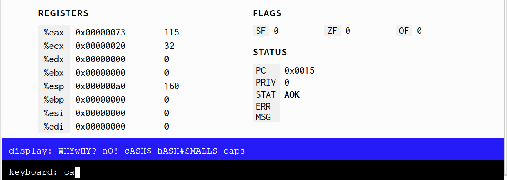

\pagebreak

##### Problem 2: I/O (50 points)

Implement (memory-mapped) IO by connecting the LogiSim TTY and keyboard components---and installing some glue so they behave as the KBDR/KBSR and DDR/DSR we discussed in class.

That is:

* Build a KBDR, KBSR, DDR, DSR.  (These don't necessarily have to be LogiSim "registers"---just addressable locations.  With memory-mapped I/O, the standard term for these magic addressable locations is "register."    But yes, you probably don't need to use LogiSim register components---you just need to make sure that the I/O circuit does the right thing when the CPU reads or writes to one of those locations.)
* that, on the one side, are reachable by the processor as addressable memory in the right places
* and that, on the other side, connect to LogiSim TTY/kb components
* such that they exhibit the correct handshaking, with respect to status bits, displayed characters, and such.

Signals
On the CPU side of the IO box:

* Inputs:
  * RAMuse: asserted by the CPU when it wants to talk with "memory"
  * RAMread: the CPU wants to read
  * RAMwrite: the CPU wants to write
  * RAMaddr: the address the CPU wants
  * data in: if writing, the byte the CPU wants to store
* Outputs:
  * data out: if the CPU is reading from a readable address the I/O box handles (that is, any of the 4 bytes in the readable registers: KBSR, KBDR, DSR), the value of that byte; otherwise, floating

On the I/O side of the I/O box:

* Inputs:
  * KB Status: does the LogiSim keyboard have a char available?
  * KB Data: the 7-bit character code from the keyboard
  * TTY ready: is the display ready to take a character?  (LogiSim's display always is; hence the manual switch in the testing skeleton)
* Outputs:
  * KB RdEn: the keyboard should pay attention to the clock rise
  * KB Clear: clear the keyboard buffer
  * TTY Data: a 7-bit character code the display should display
  * TTY Enable: the display should pay attention to the clock rise
  * TTY Clear: clear the display buffer

The "reset" line should reset everything to a clean initial state (e.g. by clearing the keyboard and TTY).

---

A wrinkle: the assembly mrmovl and rmmovl instructions access 4 bytes at a time, but your device will be addressed one byte at a time...  so it needs to recognize 16 addresses (4 for each "register")

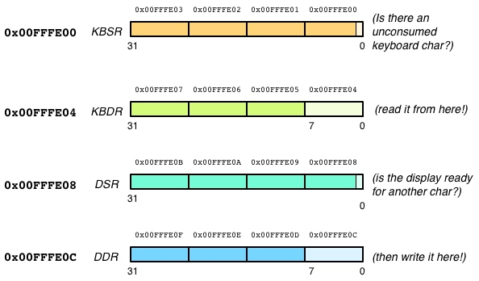

To make life easier for the programmer, for the readable registers (addresses $0x00FFFE00$ through $0x00FFFE0C$), any unspecified bit should be 0.

Notes on keyboard behavior:

* If (on the left) you send in the KBSR address and wiggle the lines for read, the data out should be 1 if and only if there's an unconsumed char waiting for you.
* If you then send in the KBDR address and wiggle the lines for a read, the data out should be that char---but the act of doing this should "consume" that char.      (So if you only typed one char, then subsequent KBSR reads would get 0.)   You don't need to add a flip-flip to do this---explore the behavior of the three input lines to LogiSim's "keyboard" device.

Notes on display behavior:

* If the TTY Read line on the right is 1 and the CPU on the left wiggles the lines for a write (e.g., of 0x00000041) to the DDR address, then your IO box should send 0x41 to the display on clock rise. If the CPU keeps doing that for successive clock rises, then your box should send successive 0x41's.... but the CPU you build won't do that.

\newpage

###### **Solution 2**

To build the I/O circuit, I started by processing the address to determine if it's within the needed range for the addresses for KBDR< KBSR, DDR, or DSR; the address has to be within the range $0x00FFFE00$ through $0x00FFFE0C$.

I checked for this condition by checking if the address is less than $0x00FFFE0D$ and greater than or equal to $0x00FFFE00$.

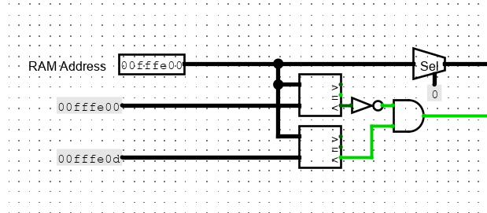

I then filter out the last byte in the address run it through a decoder to figure out which bit address is needed. The decoder has it's enable bit linked to the output of the above check for the range.

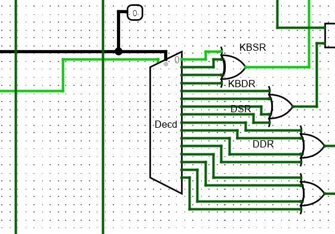

After decoding, the next check is to ascertain that the CPU actually wants to read/write -- a logical AND between the outputs of the decoder and a signal from the CPU's RAM-Use and RAM-Read / RAM-Write channels, depending on whether the target register is the keyboard or the display, and if the target register is the display, whether the target operation is a poll for readiness ork a request to write.

\newpage

Finally, depending on the target operation, either the keyboard / display readiness signals are extended from 1 bit to 8 and channeled through to output, the current character is consumed from the keyboard and channeled to output, or the incoming data is sent to the display.

The *KB read enable* and *TTY enable* flags are also set as appropriate.

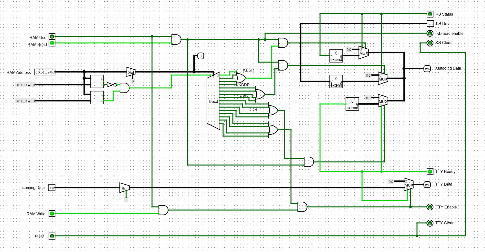

\newpage

**Test 1: Reading the "Keyboard Ready" flag.**

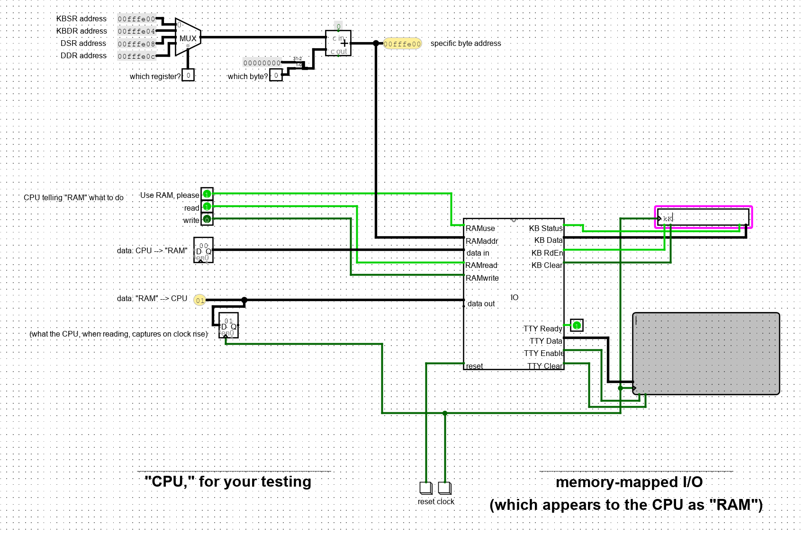

\newpage

**Test 2: Reading the character from the keyboard.**

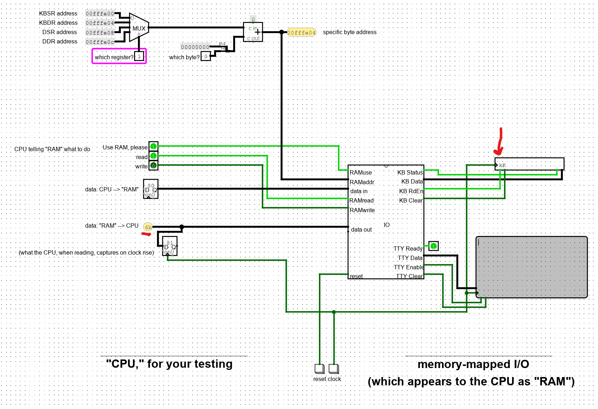

\newpage

**Test 3: Reading the "display ready" flag.**

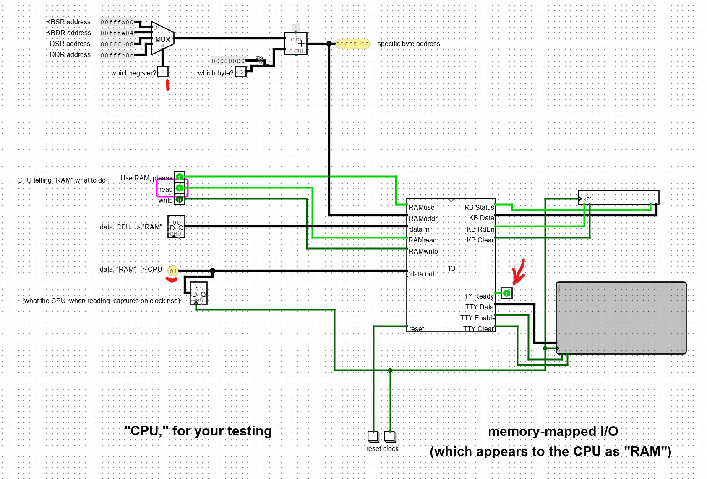

\newpage

**Test 4: Writing multiple characters to the display.**

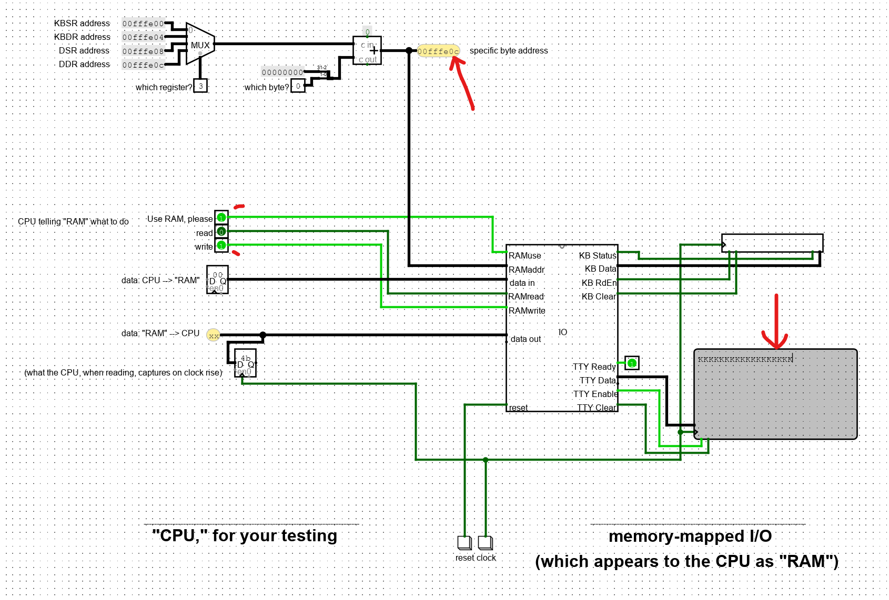

\pagebreak

##### Problem 3: Microsequencer (25 pts)

You will be building (and then, later, extending) an FSM to drive your Y86.

A 6-bit field should more than enough space to specify the current state.

In the FSM we will build up, most of the time, each state has exactly one "next" state. However, there are also exceptions:

Sometimes, we want to self-loop if the wire "DMemReady" is zero.  (Meaning: the data access to memory is not yet done!)
Sometimes, we want to self-loop if the "IMemReady" zero.   (Meaning: the instruction access to memory is not yet done!)  But if it's one, then we want to branch to one of about 12 states, based on a 4-bit "icode" field.
So... we need a microsequencer (as we built in the traffic light FSM) to help us calculate next-state transitions like this. Build this microsequencer for your Y86:

[Microsequencer](img/Q3.1.jpg)

E.g.:

* if "select" = 00, then just pipe the "CurrentState" input to "NextState"
* if "select" = 10 and "DMemReady" == 1, then pipe "valN" to "NextState"
* etc.

**Don't use any internal registers; the outputs should follow directly from whatever the inputs are.**

\pagebreak

###### **Solution 3**

To build the microsequencer, I used specific processing steps for each possible state of the *select* bit:

1. If select is set to $00$, then the circuit passes the value of $CurrentState$ to $NextState$.
2. If select is set to $01$, then the circuit passes the value of $valN$ to $NextState$.
3. If select is set to $10$, then; if $DMemReady$ is set to $1$ then the circuit passes $valN$ to $NextState$, otherwise the circuit passes $CurrentState$ to $NextState$.
4. If select is set to $11$, then; if $IMemReady$ is set to $1$ then the circuit passes $icode$, extended with $1$'s, to $NextState$, otherwise the circuit passes $CurrentState$ to $NextState$.

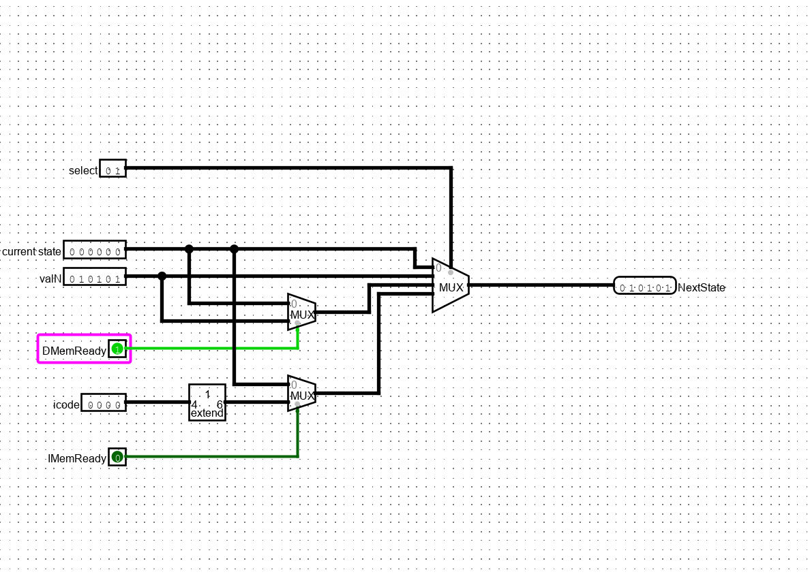

\pagebreak

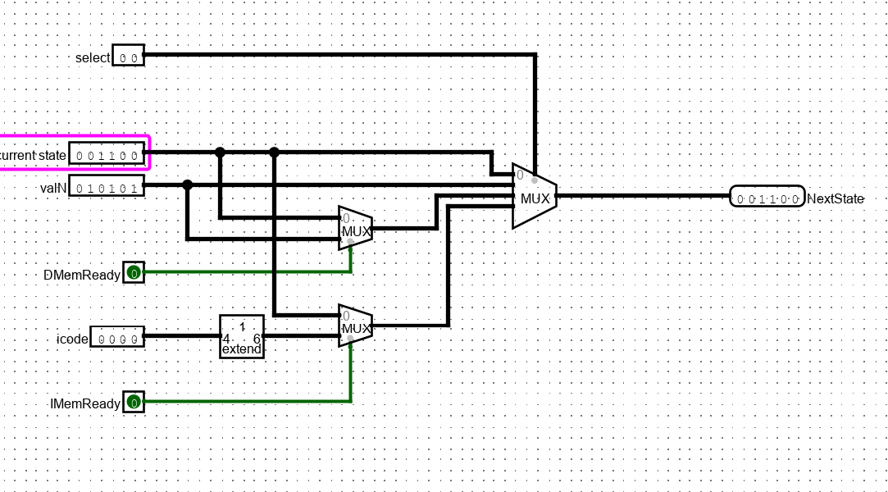

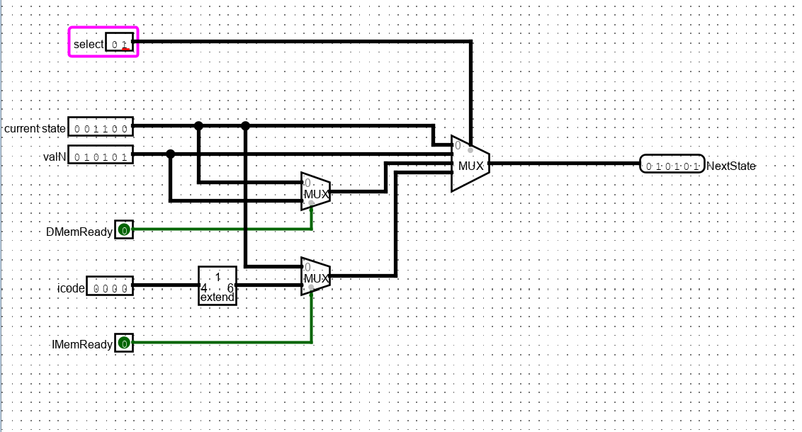

\pagebreak

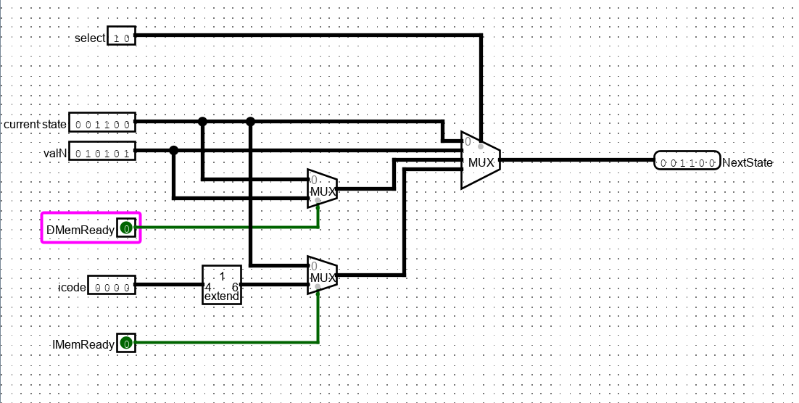

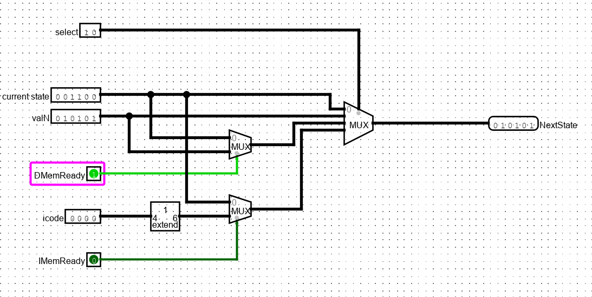

\pagebreak

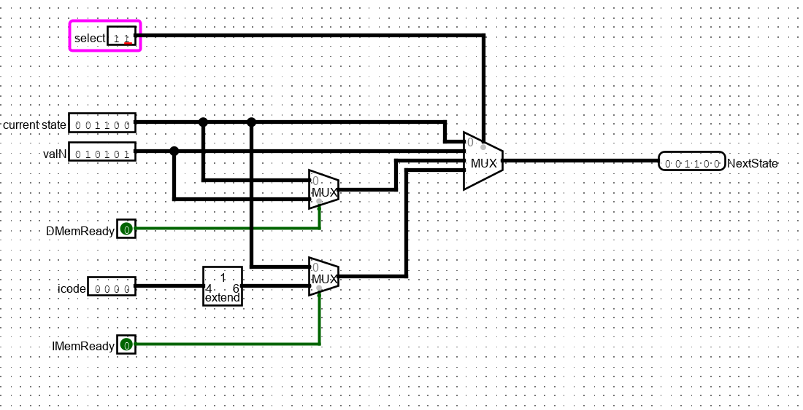

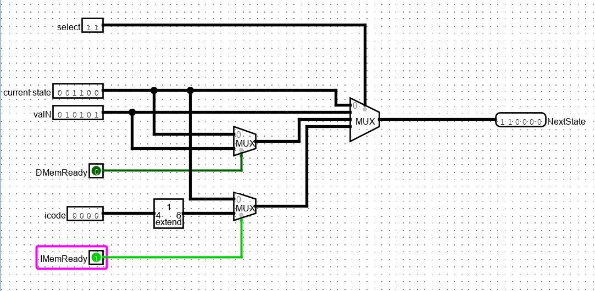
