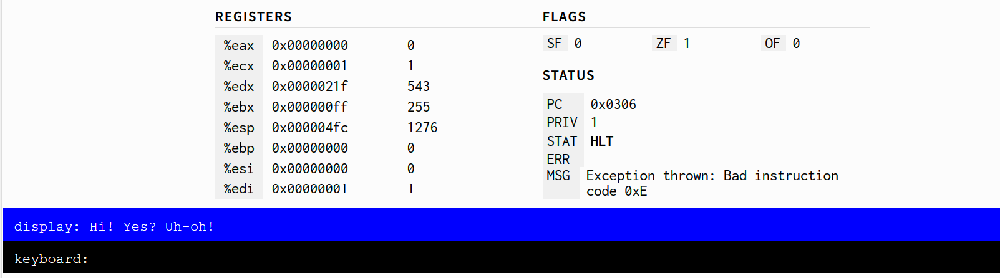
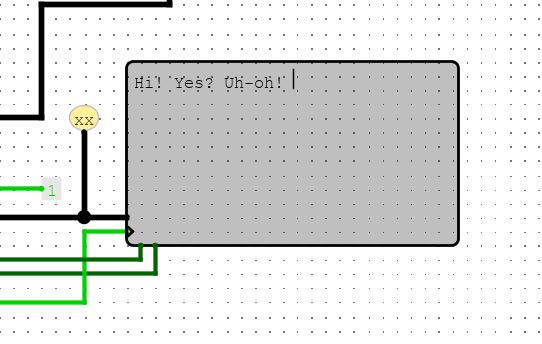

# CS-51: Computer Architecture

## Homework 8

### Student: Amittai Wekesa

#### Q1: PRIV Mode

1. I wired an extra two bits into my FSM output: `sysreq`, a value that asserts that an instruction wishes to alter the system privilege mode, and `sysVal`, a bit that is stored in the privilege register when `sysreq` is asserted and the clock rises. Additionally, I built the register circuit for storing the current `priv` value. Certain operations, such as writing to IO, check the value of the `priv` register and only perform the requested operation if the system privilege mode is 0.

2. Because the two instructions share an icode (but assert ifun as either 0 or 1), I added a check that, if `icode` equals `0xd`, adds the value of `ifun` to icode thus differentiating the two instructions. `sysexit` merely changes the value of `priv` to 1 and increments PC by 1, while `sysenter` performs an identical operation to `call 0x100` and saves the current PC + 1 to the stack. On return, the program shall return to the next instruction at PC + 1. I tested the two instructions using two programs, `sysexit.ys`, which simply changes the priv bit to 1, and `sysexit-enter.ys` which changes the priv bit to 1 then back to 0.

3. The hardware exception line is triggered by `DMemUse` being asserted together with an IO address while `priv` is not 0, and results in the priv value being reset to 0 and the code at `0x200` to be executed next. The exception does not save the current PC -- nor increment it, because there shall be no need to return to the current / next instruction.

4. The test program prints "Hi! Yes? Uh-oh!" to the tty before HALTING.

\pagebreak

#### Q2: MMU

Please see comments inside the circuit.
